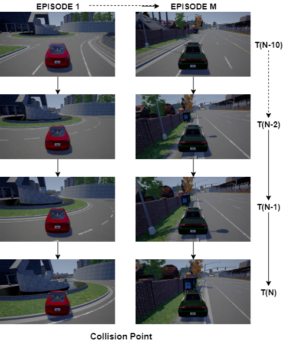
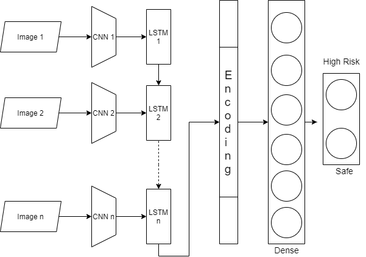
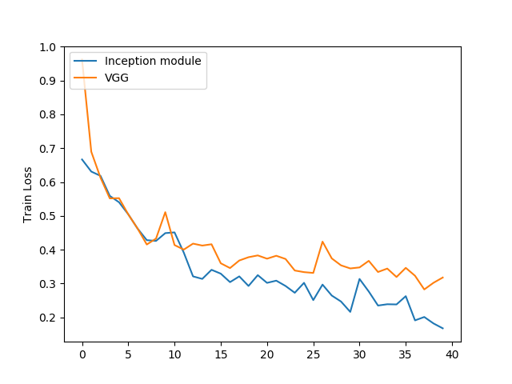
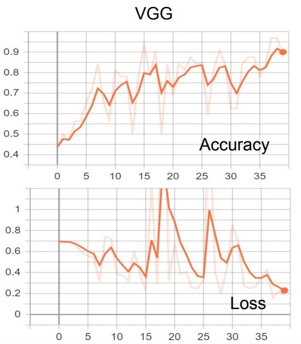

# A View NOT to Kill

## About

The aim of the project is to predict whether a vehicle is in a collision course using a series of images **moments before it happens.**  The project combines both CNNs and LSTMs to get time series prediction using image data. Various phases and challenges faced during this project is discussed. Addingthe time aspect to the images not only gives us a better understanding of the situation but it can
give us better prediction ahead of time.
The project can be divided into three stages:
Collecting Data, Creating the appropriate Network Architecture and Training.

## Configuration
* Python 3.7
* TensorFlow 1.14
* Carla 0.9.5

## Data Collection 

A solid simulation environment is needed to collect data. CARLA is a driving simulation software which can provide environment level control. Since we need to replay the memories from the accident point, CARLA raises red flags whenever a violation is made or an accident is caused. 
Firstly, we have a naive agent which drives the car around the city and takes photos every 10 frames. We use a naive agent so that we can capture more accidents and violations. Once an accident occurs or a violation is caused, CARLA raises red flags and from that time step when the accident occurs, we can take the past 10 images of the episode. So, if we look at the series of images, each image has put us closer to the accident as time moves forward. 

The data structure that was needed for the project was quite unique and in order to run automated random collisions, custom scripts were created to make the accidents happen and collect data for a given number
of episodes. 

A total of 7000 (episodes) x 2 (classes) = 14000
samples were collected with each sample containing
about 8 images for training the network. Data augmentations are not applied because the nature of environment and These samples are collected around
various towns and different environment conditions
available in Carla to make it robust across different
conditions.

Stored data format:

Image Sequences across episodes:

## Model Architecture
we can use Convolutional Neural Networks. CNNs are proven to be the best method to extract spatial information. We are going to use some of the standard CNN architectures to extract the features from the image. So, for each image in the series we will get a feature vector of fixed size which can be passed into their respective LSTM time step cells. 

Once these features are extracted in the form of embedding vectors which are of length M, all these images are passed into their respective LSTM cells in their timestep. Now these embedding are taken into the encoder and then passed to the fully connected layers which in turn learns the classification task.

 

## Final Architecture:

## Design Choice 

Increasing the number of LSTM units in the LSTM layer improved the performance for bit and after that increasing the number of layers does not make any difference but adding a LSTM layer to the network helped improve the performance of the network and this actually enables the network to learn a more complex time function and the network improved to an accuracy of 83 percentage. 

### VGG like model

### Inception like model
The VGG layers worked good for the network so far but it is possible to improve the performance of the network by adding  smarter layers instead of the naive VGG layers. And to implement this idea, a couple of Inception modules\cite{inception} with carefully chosen filter numbers were employed in place of the VGG layers. Also, a modification in the fully connected layers was required to prevent overfitting and this worked amazingly well leaving the network with the final training accuracy of 93 percentage.

## Training

The figure~\ref{trainacc} shows the accuracy improvement over time and it can also be noted that the network with the inception module performed better than the VGG based CNN by a good margin.

The VGG based network has been ocsillating in its losses and even the accuracy is pretty low. On the other hand, the network with the Inception modules performs better and has a stable convergence comparatively as shown in the figure~\ref{valacc}.

## Results
Multiple video clips of a vehicle driving around in Carla environment is given to the network and it performed extremely well. The prediction is dependent on the vehicle's speed and when an actual human drives a car, the speed varies dynamically while the train samples was collected by constant speed piloting. This has an effect on predicting the future by reducing the time before incident happens when the vehicle goes fast and it predicts well in advance if the vehicle is going slow. 

  

One important thing to note here is that the network actually learnt to know when an environment is safe or risky. This can be clearly seen when the vehicle backs down from a collision, near misses the status of the network changes from risky to safe. This particular situation was never in the training samples and it really means the network learned about safe and risky environments in a meaningful way rather than just memorizing the collisions patterns alone. 

YouTube link: https://www.youtube.com/watch?v=5E20U7b_4zQ
## Lessons:
* Something
