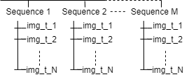
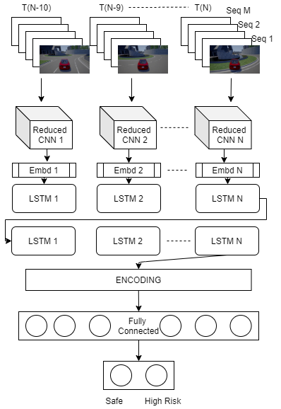
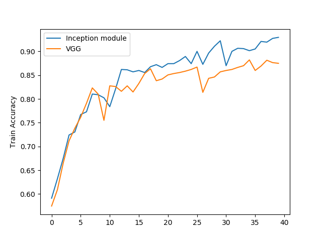
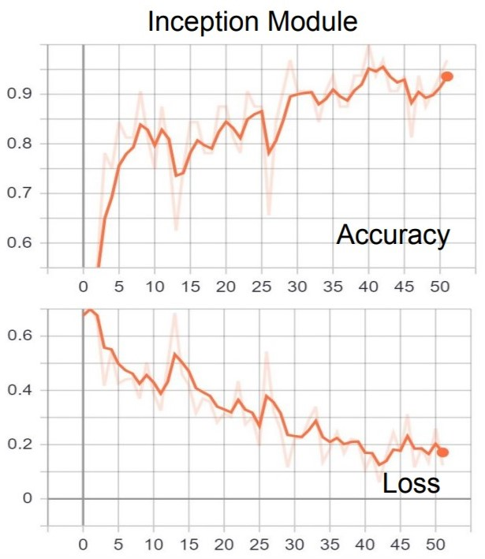
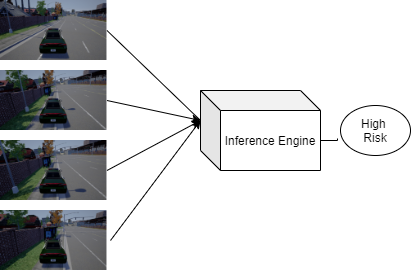

# A View NOT to Kill
A good Bond reference is always due.  
  
  
## About
 

The project combines CNNs and LSTMs to predict whether a vehicle is in a collision course using a series of images **moments before it happens.**

## Configuration
* Python 3.7
* CUDA 10, CudNN 7
* TensorFlow 1.14 
* Carla 0.9.5 [[About Carla]](https://carla.org/)
* [Carla Documentation and API usage](https://carla.readthedocs.io/en/latest/) 

***Intricate details of how the project was built at each step is explained [here](https://towardsdatascience.com/building-a-deep-learning-model-to-judge-if-you-are-at-risk-1c96f90d666c?source=friends_link&sk=20a6c7b9ea1265821d59df3286c7f42d), Why a certain thing is used or a design choice is made is clearly discussed and I would highly recommend reading it if you want to go deep about any aspect of the project.***  

## Data Collection 

* The data is collected for both the safe and risky classes with 7000 sequences each. Each Sequence consist of 8 images before the collision.
* I wrote a custom script which runs through the carla environment and records uniform movement for the safe class. Carla has an inbuilt autopilot feature which we can use to run the vehicle safely around different towns without collisions. [Autopilot script](https://github.com/perseus784/Vehicle_Collision_Prediction_Using_CNN-LSTMs/blob/master/collect_data_autopilot.py).
* Collecting images while making accidents were a little more challenging, carla has inbuilt accident sensors which can be leveraged to record and take only the last 8 images before the incident. The images were taken in a particular frame rate and sampling to have more variance in the series of images. [Random collision maker script](https://github.com/perseus784/Vehicle_Collision_Prediction_Using_CNN-LSTMs/blob/master/collect_data_make_collisions.py).
* The collected images were hard to handle because of the number of files and data size. So, the images are batched in numpy arrays of 8 and stored in seperate files. This reduced the number of files and made batching process easy. The final data if 8 GB in size.

* Download and extract [this](https://drive.google.com/drive/folders/1Knt_km3kCEIZaxp_qXG60l5-UWe4G2QQ?usp=sharing) folder in current directory inside a directory named "files" to access the models, tensorboard summaries and a sample of the dataset.

* Entire dataset can be downloaded [here](https://drive.google.com/drive/folders/1XQNXqmRRU8c4qxhwZFEq5fOburvWgTNm?usp=sharing)(8 GB).

## Model Architecture
 

* The nature of problem requires a CNN+LSTM architecture. After different experiments with various architectures and hyper parameters, the final model consists of a very diluted GoogleNet like network with two Inception modules for the CNN part and contains two LSTM layers with 32 hidden units each. 

* The CNN is then wrapped into a **time distributed layer** at each step to make it available for each of the time steps. By this way, we don't have to learn the image 8 different time. Time distributed layer makes the same network avaialble for all the time steps, reducing the time, complexity and size of the network. 

* At the end of LSTM layers, we also have some fully connected layers with dropout to learn the classification task. [Model Architecture](https://github.com/perseus784/Vehicle_Collision_Prediction_Using_CNN-LSTMs/blob/master/model_architecture.py).

* This Architecture helps us learn an objective function for data which has a Spatio-Temporal Correlation. The network can be modified a little bit and **can be adapted to any kind of action recognition or time series prediction task.** 

## Training
* It is a network with around 14 million parameters and it required a really good GPU for training or it ran into memory exhaust errors. * Used a GTX 1080 Ti machine in which the training was done within 3 hours.
* Able to achieve an accuracy of 93% after a lot of hyper parameter and architectural modifications.[Training Script](https://github.com/perseus784/Vehicle_Collision_Prediction_Using_CNN-LSTMs/blob/master/avntk.py).
* The training metrics can be seen in the following images.

 

## How to Run
  

* Have a look at the [Wiki](https://github.com/perseus784/Vehicle_Collision_Prediction_Using_CNN-LSTMs/wiki).
* Refer [Configuration](https://github.com/perseus784/Vehicle_Collision_Prediction_Using_CNN-LSTMs/blob/master/config.py). 

* Collect data using [Autopilot script](https://github.com/perseus784/Vehicle_Collision_Prediction_Using_CNN-LSTMs/blob/master/collect_data_autopilot.py) , [Random collision maker script](https://github.com/perseus784/Vehicle_Collision_Prediction_Using_CNN-LSTMs/blob/master/collect_data_make_collisions.py).
* Get the data in particular format required by the network and Put the files in the respective folders.
* Modify the configuration to your needs. 
* Modify the network if required. **Exercise Caution!!**
* Run [avntk.py](https://github.com/perseus784/Vehicle_Collision_Prediction_Using_CNN-LSTMs/blob/master/avntk.py) with train mode to train the network, the default is test mode.
* See Use the best model created to test on a given video in **inference mode** by running the same script.

## Results
  

Ultimately, the system should be supplied with the video feed and we will be getting a safety level for the given series of images. So for every moment in time, a safety flag is obtained. This can not only be employed in a self-driving car’s decision making system but also a manual car’s emergency protocol system to prevent extreme events. 

The core of the project is to extract the Spatio-Temporal information and use it to understand our environment better for risk prediction, context understanding, action recognition, scene understanding and forecasting etc.

*Full Video: https://www.youtube.com/watch?v=5E20U7b_4zQ* 

***Intricate details of how the project was built at each step is explained [here](https://towardsdatascience.com/building-a-deep-learning-model-to-judge-if-you-are-at-risk-1c96f90d666c?source=friends_link&sk=20a6c7b9ea1265821d59df3286c7f42d), Why a certain thing is used or a design choice is made is clearly discussed and I would highly recommend reading it if you want to go deep about any aspect of the project.***  

Please raise an issue or contact me if you have any doubts.

***Please Star if you like the project!***  

**Hit me up!**   

[LinkedIn](https://www.linkedin.com/in/ipaar/) , <a href = "mailto: ipaar3@gmail.com">ipaar3@gmail.com</a>
  
  
